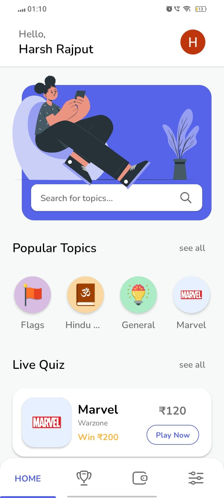
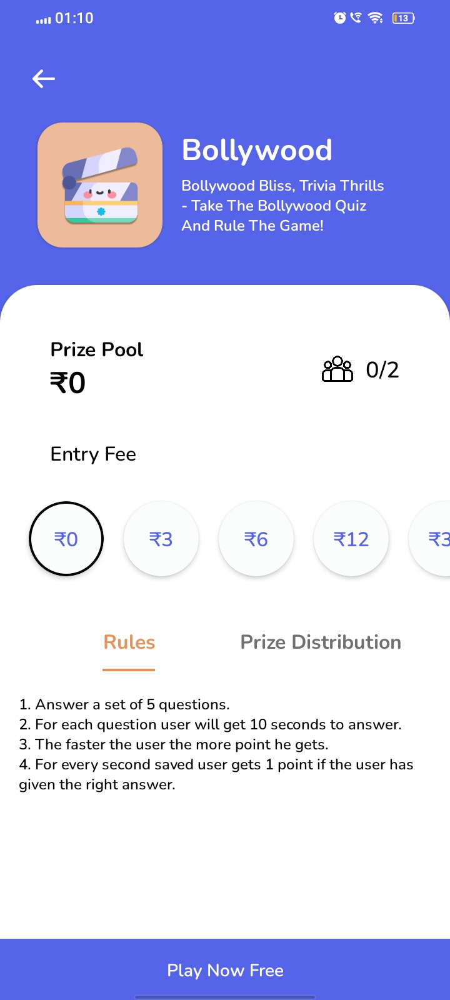
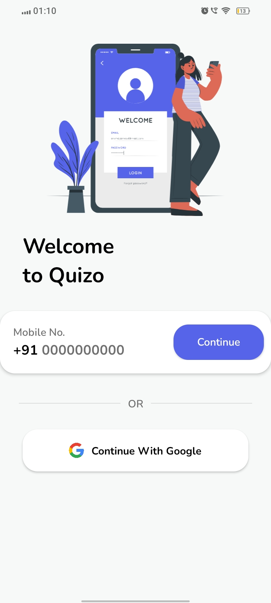

# Quizo App

Welcome to the Quizo app GitHub repository! Quizo is an innovative quiz and gaming app that offers a wide range of features for users to enhance their knowledge and earn rewards. This README file provides an overview of the app's features and how to get started.

## Download

You can download the Quizo app from [here](https://quizo.fun/download).

## Screenshots

|  |  |  |
|-----------------------------------------------|-----------------------------------------------|-----------------------------------------------|

## Getting Started

To get started with Quizo, follow these steps:

1. **Clone the repository:**

   git clone https://github.com/harshrajput1506/quizo

2. **Open the project in Android Studio:**

3. **Build and run the app on an emulator or physical device:**

## Features

- **Personalized Quizzes**: Tailored quizzes based on user interests.
- **Multiplayer Mode**: Real-time multiplayer mode for competing against friends.
- **Leaderboard**: Compete against others and climb the leaderboards.
- **Earn and Play**: Participate in quizzes with entry fees to win prize pools.
- **Diverse Categories**: Choose from a variety of categories including sports, history, science, and more.
- **User-Friendly Interface**: Easy-to-use interface for seamless navigation.
- **Continuous Improvement**: Regular updates and enhancements for an improved user experience.

## Libraries Used

- **Firebase SDK**: Integration with Firebase services including Authentication and Firestore.
- **Volley Library**: HTTP library for network requests.
- **Lottie**: Animation library for adding dynamic animations.
- **Glide**: Image loading library for efficient handling of images.
- **Firebase Cloud Messaging**: Library for sending push notifications.
- **Google Play Services**: Integration for accessing Google services like Maps and location data.

## Contributing

Contributions to Quizo are welcome! If you have any ideas for new features, improvements, or bug fixes, feel free to open an issue or submit a pull request.

## License

This project is licensed under the MIT License - see the [LICENSE](LICENSE) file for details.

